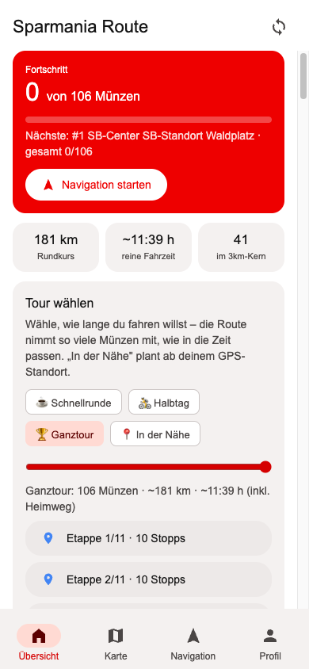
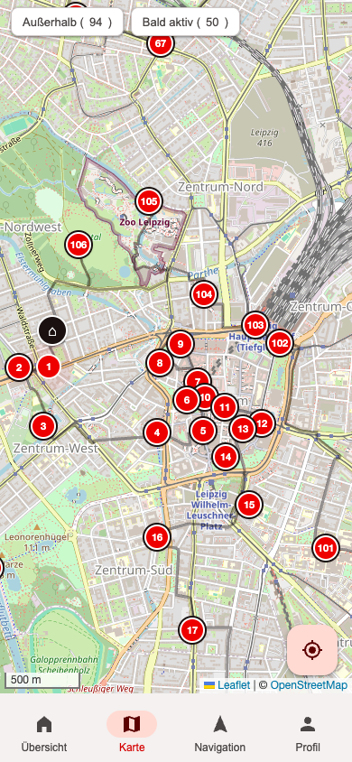
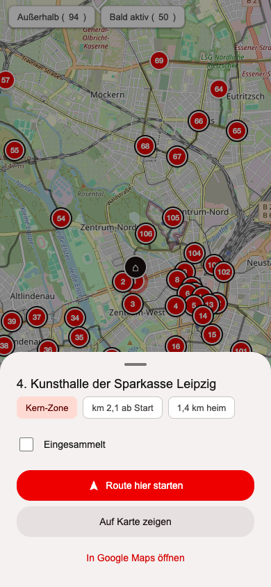
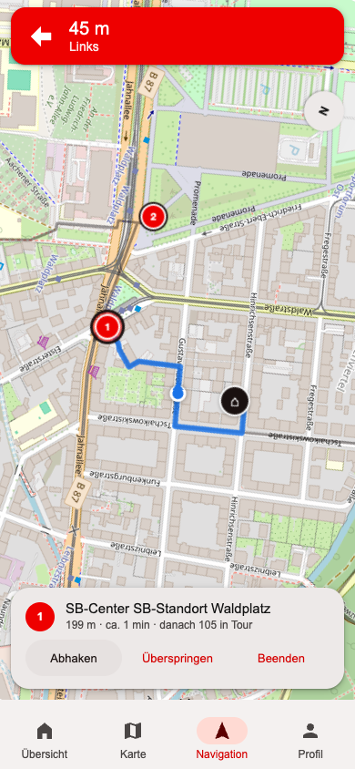
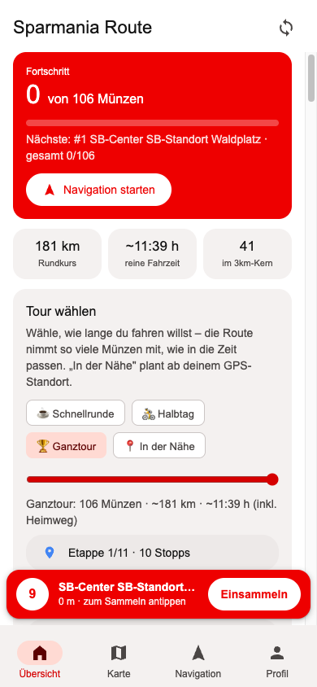
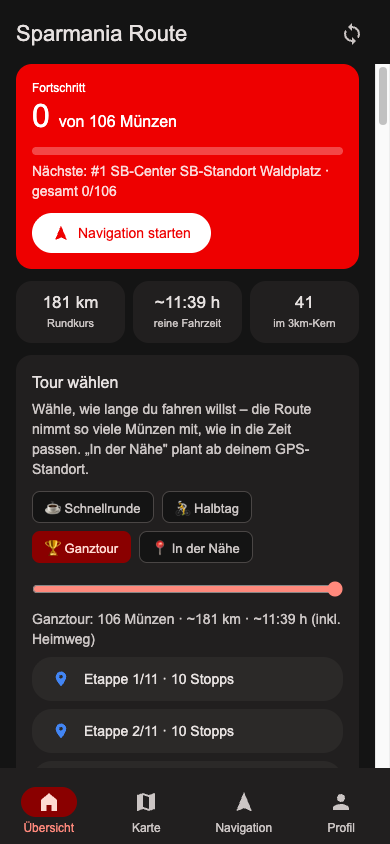

# Funktionen im Detail

Alle Screenshots stammen aus der Web-App (iPhone-Größe). Die Android-App ist funktional identisch.

## Übersicht (Home)

Der Einstieg. Oben der **Fortschritt** der aktuell gewählten Tour und der gesamte Sammelstand
(„gesamt X/106"). Darunter drei Kennzahlen (Rundkurs-km, reine Fahrzeit, Anzahl Münzen im
dichten 3-km-Kern). „**Navigation starten**" springt direkt zur nächsten offenen Münze.

Ganz unten die vollständige **Münz-Liste** der Tour, in Fahr-Reihenfolge, in 25er-Abschnitte
gegliedert. Der Chip „↓ nächste offene" scrollt zur nächsten noch nicht gesammelten Münze und
hebt sie kurz hervor. Jede Zeile lässt sich abhaken oder für Details antippen.

## Touren wählen (Zeit / Größe / Nähe)

Die Karte „**Tour wählen**" bestimmt, wie viel du fährst:

- **Zeit-Slider** – wähle dein Zeitbudget (30 min bis 12 h). Die Route nimmt so viele Münzen
  mit, wie in die Zeit passen (inkl. Heimweg), ohne das Budget zu überschreiten.
- **Presets** – ☕ Schnellrunde (~1 h), 🚴 Halbtag (~3 h), 🏆 Ganztour (alle 106).
- **📍 In der Nähe** – plant ab deinem aktuellen GPS-Standort per Nächster-Nachbar-Suche die
  Münzen in Reichweite deines Zeitbudgets.

Die gewählte Tour steuert **Liste, Navigation und Google-Maps-Export** gleichzeitig. Änderst du
die Tour, bleibt eine bereits laufende Navigation unangetastet.

## Karte

Alle Münzen der Route als Pins:

- **Rote Pins** = Münzen der Route (nummeriert in Fahr-Reihenfolge).
- **Roter Pin mit schwarzem Ring** = Kern-Zone (der dichte, effizienteste Bereich).
- **Grauer Pin mit ✓** = bereits eingesammelt.
- **Schwarzer ⌂** = Start/Ziel (Rundkurs).
- Über die Chips lassen sich zusätzlich Münzen **außerhalb** der Route und **bald aktive**
  einblenden.

Der ◎-Button ortet dich per GPS. Tippt man einen Pin an, öffnet sich das Detail-Blatt:

Von hier: **Route hier starten** (Navigation genau ab dieser Münze), auf der Karte zeigen,
oder direkt in Google Maps öffnen.

## Turn-by-Turn-Navigation

Führt wie ein Auto-Navi von Münze zu Münze, aber auf Fahrradwegen (OSRM):

- **Rotes Banner** mit Abbiege-Anweisung und Entfernung zum nächsten Manöver.
- **Blaue Live-Route** vom Standort zur Zielmünze, mit automatischem **Rerouting**, wenn du
  abweichst.
- **Heading-up:** die Karte dreht sich in Fahrtrichtung (per Kompass-Button umschaltbar auf
  Norden-oben).
- **Ankunft:** bei < 40 m erscheint die Sammel-Karte mit **„Einsammeln"** (offizielle Seite),
  **„Abhaken & weiter"** (springt zur nächsten Münze) und **„Überspringen"**.
- Der Bildschirm bleibt während der Navigation an (Wake Lock, iOS 16.4+ / Android).

## Münz-Signal & Schnell-Einsammeln

Kommst du einer offenen Münze näher als 70 m, **klingelt** ein Münz-Ton (plus Vibration auf
Android) und es erscheint eine rote **Reichweiten-Leiste** mit der Münze und
einem **„Einsammeln"**-Knopf. Ein Tap öffnet die offizielle Sammel-Seite (in der Android-App
im integrierten Browser mit QR-Scanner). Das Signal lässt sich auf der Übersicht abschalten.

## Google-Maps-Export

Jede Tour erzeugt Etappen-Buttons „In Google Maps öffnen". Da Google Maps pro Link nur
**9 Zwischenstopps** in der App zulässt (im Mobil-Browser sogar nur 3), wird die Tour in
lückenlose Etappen à max. 11 Punkte (Start + 9 Wegpunkte + Ziel) geteilt – die Ganztour z. B.
in 11 Etappen. Jede Etappe öffnet Google Maps im **Fahrrad-Modus**.

## Dark Mode

Folgt automatisch dem System-Dunkelmodus (in der App über den Android-Nachtmodus, im Browser
über die Systemeinstellung, mit Live-Umschaltung). Die Kartenkacheln werden abgedunkelt.

## Fortschritt & Profil-Sync

Eingesammelte Münzen werden lokal gespeichert (überlebt Neustarts). Die **Android-App** kann
zusätzlich deinen **offiziellen Sammelstand** aus dem Sparmania-Profil übernehmen: einmal im
Profil-Tab einloggen, dann „Fortschritt synchronisieren". In der reinen Web-App funktioniert
das aus technischen Gründen (Cross-Origin) nicht – dort hakst du selbst ab.
